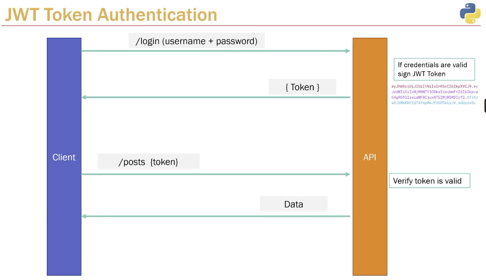

# FastAPI Notes
FastAPI works by defining path operations that map HTTP requests to Python functions.
Uvicorn acts as the ASGI server receiving network traffic.
FastAPI validates data using Pydantic and returns JSON responses.
If validation fails, FastAPI automatically returns structured errors.
## Setup
- Create project: `uv init --app --name backend_api --description "FastAPI Backend API"`
- Run app: `uv run uvicorn app.main:app --reload`
- Swagger docs: http://127.0.0.1:8000/docs#/
- uv run uvicorn app.main:app --reload
- uv export --no-hashes > requirements.txt
## Core Concepts
- **Path operations** — the combination of an HTTP method + URL path + Python function.
- **Pydantic** — ensures incoming data has the correct structure and types.


## CRUD Operations
- **Create** → `@app.post` — accepts a Pydantic model as body, use `status_code=201`.
- **Read** → `@app.get` — use `{id}` in path for single resource, auto-validated by type.
- **Update** → `@app.put` — path param + Pydantic body. Use `.model_dump()` to convert model to dict.
- **Delete** → `@app.delete` — convention is `204 No Content` with empty body.
- **HTTPException** — raise to return errors like `404 Not Found` with a detail message.
- **`status` module** — use `status.HTTP_201_CREATED`, `status.HTTP_404_NOT_FOUND`, etc. for readability.
- **Route order** — static routes (`/posts/latest`) must come before dynamic routes (`/posts/{id}`).

## Database Management

### Why a Database?
- Storing data in memory (Python lists/dicts) is lost on every restart.
- A database persists data to disk and supports concurrent access, queries, and relationships.

### PostgreSQL Setup
- **PostgreSQL** — a powerful, open-source relational database.
- Default port is `5432` (this project uses `5433`).
- Connect using: host, dbname, user, password, port.
- Use a tool like **pgAdmin** or the `psql` CLI to manage databases and tables.

### Creating a Table
```sql
CREATE TABLE posts (
    id        SERIAL PRIMARY KEY,
    title     VARCHAR NOT NULL,
    content   VARCHAR NOT NULL,
    published BOOLEAN NOT NULL DEFAULT TRUE,
    created_at TIMESTAMP WITH TIME ZONE NOT NULL DEFAULT NOW()
);
```
- `SERIAL` — auto-incrementing integer (PostgreSQL generates the ID).
- `PRIMARY KEY` — uniquely identifies each row.
- `NOT NULL` — column cannot be empty.
- `DEFAULT` — value used when none is provided.

### psycopg3 (Database Driver)
- **psycopg** (`psycopg3`) is the Python adapter for PostgreSQL.
- Install: `uv add psycopg[binary]`
- `row_factory=dict_row` — returns rows as dictionaries instead of tuples, making them JSON-friendly.
- **Connection pattern** — use a `while True` + `try/except` loop to retry until the DB is available:
```python
while True:
    try:
        conn = psycopg.connect(host="localhost", dbname="backendapi",
                               user="postgres", password="admin",
                               port="5433", row_factory=dict_row)
        cursor = conn.cursor()
        print("Connection to database successful")
        break
    except Exception as error:
        print("Error:", error)
        time.sleep(2)
```

### SQL CRUD with Parameterized Queries
Always use `%s` placeholders — **never** use f-strings or string concatenation for SQL. This prevents **SQL injection** attacks.

| Operation | SQL Pattern | Example |
|-----------|-------------|---------|
| **Create** | `INSERT INTO ... VALUES (%s, ...) RETURNING *` | Creates a row, returns it |
| **Read (all)** | `SELECT * FROM posts` | Fetch all rows |
| **Read (one)** | `SELECT * FROM posts WHERE id = %s` | Fetch by ID |
| **Update** | `UPDATE posts SET ... WHERE id = %s RETURNING *` | Modify and return |
| **Delete** | `DELETE FROM posts WHERE id = %s RETURNING *` | Remove and return |

- `RETURNING *` — returns the affected row(s) so you can send them back in the API response.
- `cursor.fetchone()` — get one result row.
- `cursor.fetchall()` — get all result rows.
- `conn.commit()` — **required** after `INSERT`, `UPDATE`, `DELETE` to save changes. `SELECT` does not need it.

### Common Pitfalls
- **Forgetting `conn.commit()`** — changes are not saved to DB until you commit.
- **SQL injection** — never do `f"SELECT * FROM posts WHERE id = {id}"`. Always use `%s` parameterized queries.
- **`%s` tuple syntax** — for a single param, use `(value,)` with a trailing comma: `(str(id),)`.
- **Indentation errors** — Python is whitespace-sensitive. Use **4 spacess** consistently. Mixed indentation (e.g. 3 spaces on one line, 1 on another) causes `IndentationError`.

### SQLAlchemy doesn't let you modify the table after they are created so to do migtations things like this, we use Alembic

## SQLAlchemy ORM

### Project Structure
- **`database.py`** — engine, session factory (`SessionLocal`), `Base` class, and `get_db` dependency.
- **`models.py`** — SQLAlchemy models (define DB table columns). Inherit from `Base`.
- **`schemas.py`** — Pydantic models (define request/response shapes). Separate from DB models.

### ORM CRUD Pattern
Instead of raw SQL, use SQLAlchemy query methods:
| Operation | Raw SQL | SQLAlchemy ORM |
|-----------|---------|----------------|
| **Read all** | `SELECT * FROM posts` | `db.query(models.Post).all()` |
| **Read one** | `SELECT * WHERE id = %s` | `db.query(models.Post).filter(models.Post.id == id).first()` |
| **Create** | `INSERT INTO ... VALUES ...` | `db.add(new_post)` → `db.commit()` → `db.refresh(new_post)` |
| **Update** | `UPDATE ... SET ... WHERE ...` | `query.update(data, synchronize_session=False)` → `db.commit()` |
| **Delete** | `DELETE FROM ... WHERE ...` | `db.delete(post)` → `db.commit()` |

### `get_db` Dependency
- Injected via `db: Session = Depends(get_db)` in each route function.
- Creates a session per request and auto-closes it when done.

## Pydantic Response Schemas

### Schema Separation
Split Pydantic models into **schemas.py** instead of defining them in `main.py`:
- **`PostBase`** — shared fields (`title`, `content`, `published`).
- **`PostCreate(PostBase)`** — used for request body (inherits base, adds nothing extra for now).
- **`PostResponse(PostBase)`** — used for response. Adds fields the API returns but the user doesn't send (e.g. `id`, `created_at`).

### `response_model`
- Controls **what the API sends back** — filters fields and validates the response shape.
- Single item: `response_model=schemas.PostResponse`
- List of items: `response_model=list[schemas.PostResponse]`

### `from_attributes = True`
- Required in `PostResponse` so Pydantic can read data from SQLAlchemy objects (which use `post.title` attribute access, not `post["title"]` dict access).
- This is the Pydantic v2 version of the old `orm_mode = True`.

### Understanding where Pydantic input and output schemas are used
- Input schemas live in function parameters because they drive execution; output schemas live in decorators because they define the external API contract and enforce response safety.

## JWT Token Authentication



### How It Works (The Flow)
1. **Client sends `/login`** with username + password.
2. **API validates credentials** — checks if the user exists and the password hash matches.
3. **If valid, API signs a JWT Token** and sends it back to the client.
   - The token is a long encoded string (e.g. `eyJhbGciOiJIUzI1NiIs...`).
4. **Client sends subsequent requests** (e.g. `/posts`) with the token attached.
5. **API verifies the token** — checks it's valid, not expired, and not tampered with.
6. **If token is valid, API returns the requested data.**

### Key Concepts
- **JWT (JSON Web Token)** — a compact, URL-safe token containing encoded JSON data. It is **not encrypted** — anyone can read it. It is **signed** so the server can verify it wasn't tampered with.
- **Token structure** — three parts separated by dots: `header.payload.signature`
  - **Header** — algorithm and token type (e.g. `HS256`).
  - **Payload** — the data (claims), e.g. user ID, expiration time. **Don't put secrets here.**
  - **Signature** — created using the header, payload, and a **secret key** only the server knows.
- **Stateless** — the server doesn't store sessions. The token itself carries all the info needed to authenticate.
- **Expiration** — tokens should have an expiry time (`exp` claim) so they don't last forever.

### Why Not Just Send the Password Every Time?
- Sending credentials on every request is insecure and inefficient.
- A token is a **temporary proof** that the user already authenticated.
- If a token is stolen, it expires — unlike a stolen password.

### Implementation (python-jose)
```python
from jose import JWTError, jwt

SECRET_KEY = "your-secret-key"
ALGORITHM = "HS256"
ACCESS_TOKEN_EXPIRE_MINUTES = 30

# Create a token
data = {"user_id": user.id}
token = jwt.encode(data, SECRET_KEY, algorithm=ALGORITHM)

# Verify a token
payload = jwt.decode(token, SECRET_KEY, algorithms=[ALGORITHM])
```


---

## Pagination

Pagination is the process of **dividing a large dataset into smaller chunks called pages**, so that data can be fetched and displayed in parts instead of all at once.

For example, if there are 1,000 users in a database, it is inefficient to return all 1,000 records in a single response. Instead, we return a smaller subset such as 10 or 20 users per request.

### Why pagination is important

Pagination is used because it:

* improves response time
* reduces server load
* saves bandwidth
* makes the UI easier to handle
* scales better for large datasets

Without pagination, an API may become slow and memory-heavy when the table grows large.

### Common idea

A client requests only a portion of the data.

Example:

```python
GET /users?skip=20&limit=10
```

This means:

* skip the first 20 records
* return the next 10 records

So the client receives records 21 to 30.

---

## Skip vs Offset

These are closely related:

* **`skip`** is often used as the API parameter name
* **`offset`** is the database/SQL term

Example in FastAPI:

```python
@app.get("/users")
def get_users(skip: int = 0, limit: int = 10):
    return db.query(User).offset(skip).limit(limit).all()
```

Here:

* `skip` comes from the request
* `.offset(skip)` applies that value in the query

Example in SQL:

```sql
SELECT * FROM users
LIMIT 10 OFFSET 20;
```

This skips the first 20 rows and returns the next 10.

---

## Types of pagination

### 1. Page-based pagination

The client asks for a page number.

Example:

```python
GET /users?page=3&limit=10
```

This means page 3, with 10 records per page.

Formula:

```python
skip = (page - 1) * limit
```

### 2. Offset-based pagination

The client directly specifies how many rows to skip.

Example:

```python
GET /users?offset=20&limit=10
```

This is simple and common in SQL-backed APIs.

### 3. Cursor-based pagination

Instead of page numbers or offsets, the client uses a pointer such as the last seen item ID or timestamp.

This is preferred in large-scale systems because it is more efficient and avoids missing/duplicated records when data changes frequently.

---

## Benefits of pagination

* Faster API responses
* Lower memory usage
* Better user experience
* Better scalability for large applications

---

## Limitation of offset pagination

Offset pagination is easy to implement, but it becomes less efficient on very large datasets because the database still has to scan past the skipped rows.

That is why many production systems eventually move to **cursor pagination**.

---

## Interview-style definition

**Pagination is a technique used to fetch and return large result sets in smaller, manageable pieces, usually by using limit with offset, page number, or cursor.**

---

## One-line memory hook

**Pagination = showing data page by page instead of loading everything at once.**

---

## Tiny practical example

```python
@app.get("/posts")
def get_posts(skip: int = 0, limit: int = 10):
    posts = db.query(Post).offset(skip).limit(limit).all()
    return posts
```

If the request is:

```python
GET /posts?skip=10&limit=5
```

then the API returns posts 11 through 15.

---

## Exam / interview note

In beginner projects:

* use `skip` and `limit`

In SQL:

* think `OFFSET` and `LIMIT`

In real large systems:

* prefer **cursor pagination**


## Storing .env(printed using printenv on remote linux system)-
### Write the below command in the .profile file of the shell
```set -o allexport; source /home/rishav/.env; set +o allexport```
## ssh -i fastAPI-backend.pem rishav@ec2-54-167-28-22.compute-1.amazonaws.com
## use ubuntu

## To connect to postgres from local, to connect the llocal host, you need to add security group inbound on aws